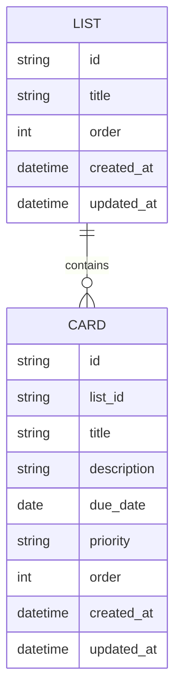

# Trello風タスク管理アプリ 要件定義書

## 1. 概要

- スクール課題として個人開発するTrello風のタスク管理アプリ
- ボードは単一のみ管理する(複数ボード管理は将来的な拡張候補として保留)

## 2. 利用者

- 利用者は自分専用(1ユーザー)。ログイン・認証機能は不要

## 3. 機能

### リスト(List)

| ID | 内容 |
|---|---|
| FR-01 | リストを追加できる(インライン入力) |
| FR-02 | リストのタイトルを編集できる(インライン編集) |
| FR-03 | リストを削除できる(「…」メニュー) |
| FR-04 | リストの並び順をドラッグ&ドロップで変更できる |

### カード(Card)

| ID | 内容 |
|---|---|
| FR-05 | カードを追加できる(インライン入力) |
| FR-06 | カード追加時、タイトルが未入力の場合は追加できない(必須項目チェック) |
| FR-07 | カードをクリックするとモーダルが開き、説明文・期限・優先度を編集できる |
| FR-08 | カードを削除できる(「…」メニュー) |
| FR-09 | カードをリスト内・リスト間でドラッグ&ドロップして並び替え・移動できる |
| FR-10 | カードの完了状態は独立したフラグを持たず、リストの位置によって表現する |

### 優先度

| ID | 内容 |
|---|---|
| FR-11 | 優先度順、または期限日順でカードを並び替えできる(リスト内のみ)。並び替えの詳細ロジックは4章の業務ルール(BR-05・BR-06)を参照 |

### データ永続化(仮)

| ID | 内容 |
|---|---|
| FR-12 | アプリを閉じる、またはリロードしてもリスト・カードのデータは保持される。保存先の技術は10章の技術スタック選定後に確定し、本項目を更新する |

### ユースケース一覧

主なアクターは「利用者(自分専用)」1名のみ。

| ID | ユースケース | 概要 |
|---|---|---|
| UC-01 | リストを作成する | ボードにリストを追加し、名前を付ける |
| UC-02 | カードを作成する | リストにカードを追加し、タイトルを入力する |
| UC-03 | カードを編集する | カードを開き、説明文・期限日・優先度を編集する |
| UC-04 | カードを別リストへ移動する | カードをドラッグして別リストへ移動し、ステータスを変化させる |
| UC-05 | カードを並び替える | 優先度順または期限日順でリスト内のカード表示順を並び替える |
| UC-06 | リスト/カードを削除する | 不要になったリストまたはカードを削除する |

## 4. 業務ルール

| ID | 内容 |
|---|---|
| BR-01 | リストを削除する際は確認ダイアログを表示し、確認後に削除を実行する |
| BR-02 | リストを削除すると、そのリストに属するカードも合わせて削除される(完全削除。アーカイブは行わない) |
| BR-03 | カードの優先度は必須ではない。デフォルトは未設定(ラベルなし)で、必要な場合にのみユーザーが設定する |
| BR-04 | カードの並び替え(ソート)はリスト単位で行い、リストをまたいだ並び替えは行わない |
| BR-05 | 優先度順ソートでは、優先度(高→中→低)を第一キー、期限日(昇順)を第二キーとする。優先度未設定のカードは優先度ありのカードより後ろに配置し、その中でも期限日昇順で並べる。期限日も未設定の場合は元のリスト内表示順を維持する |
| BR-06 | 期限日順ソートでは、期限日昇順で並べる。期限日未設定のカードは最後尾に配置し、その中は元のリスト内表示順を維持する |
| BR-07 | 期限日は必須ではない。過去の日付は設定できない |
| BR-08 | カードのタイトルは30文字以内とする |
| BR-09 | カードの説明文は1000文字以内とする |
| BR-10 | カードの削除には確認ダイアログを表示しない |
| BR-11 | 初回起動時、リストが1つもない状態を避けるため「未着手」「進行中」「完了」のデフォルトリストを用意する |
| BR-12 | ソート表示中にカードをドラッグ&ドロップすると、その時点の並び順が新しい手動順(order値)として確定され、表示は自動的に手動順(デフォルト表示)に戻る |

## 5. 画面

簡易ワイヤーフレーム(Markdown)。実際に動作するモック/プロトタイプ作成前の方向性確認用。

- 期限日の入力はカレンダーを表示してのクリック選択とする

### 画面A: ボード全体(メイン画面)

```
==================================================================
 Trello風タスク管理アプリ
==================================================================
 [未着手  ⇅ …]     [進行中  ⇅ …]     [完了    ⇅ …]    [+ 新しいリスト]
------------------ ------------------ ------------------
 +--------------+  +--------------+  +--------------+
 | 資料作成   … |  | 実装作業   … |  | 環境構築   … |
 | 優先度:高    |  | 優先度:中    |  |              |
 | 期限:08/25   |  |              |  |              |
 +--------------+  +--------------+  +--------------+
                    +--------------+
                    | レビュー対応 …|  ← 期限超過カードは赤背景/赤文字(NFR-01)
                    | 期限:08/18   |
                    +--------------+
 [+ カードを追加]   [+ カードを追加]   [+ カードを追加]
==================================================================
```

- `…` は各リスト見出し・各カードに出す「…」メニューボタン(FR-03/FR-08)
- `⇅` は各リストの並び替えメニュー(デフォルト/優先度順/期限日順)を開くボタン(FR-11)。ソートはリストごとに独立して設定する(BR-04)
- リストの右端に「+ 新しいリストを追加」(インライン入力、FR-01)

### 画面B: カード詳細モーダル(カードクリックで開く、FR-07)

```
+--------------------------------------------------+
| ✕                                                 |
| タイトル: [ レビュー対応                        ] |
|                                                    |
| 説明文:                                           |
| +------------------------------------------------+|
| |                                                  ||
| +------------------------------------------------+|
|                                                    |
| 期限日: [ 2026/08/18 ▾ カレンダーから選択 ]       |
| 優先度: ( )高  ( )中  (●)低  ( )未設定            |
|                                                    |
|                                    [削除]  [保存] |
+--------------------------------------------------+
```

### 画面C: 「…」メニュー(リスト/カード共通、削除確認はリストのみ)

```
リスト見出し: 進行中  [ … ]
                        └─ 削除(クリックで確認ダイアログ表示 / BR-01)

カード: レビュー対応   [ … ]
                        └─ 削除(確認なしで即削除 / BR-10)
```

## 6. データ

Trelloの「ボード > リスト > カード」の3階層構造を踏襲するが、ボードが単一のため実質「リスト > カード」の2階層で管理する。

### E-R図



### List(リスト)

| 項目 | 内容 |
|---|---|
| id | リストの識別子 |
| title | リスト名 |
| order | 表示順 |
| created_at / updated_at | 作成日時・更新日時 |

### Card(カード)

| 項目 | 内容 |
|---|---|
| id | カードの識別子 |
| list_id | 所属リスト |
| title | タイトル(必須、30文字以内) |
| description | 説明文(1000文字以内) |
| due_date | 期限日(任意。過去日は設定不可、日付のみで時刻は持たない) |
| priority | 優先度(高 / 中 / 低の3段階、任意。未設定可、デフォルトは未設定) |
| order | リスト内の表示順 |
| created_at / updated_at | 作成日時・更新日時 |

補足: カードの完了状態は独立したフラグとして持たせない。「リストの位置がそのままステータスを表す」というTrelloの思想に寄せる(例: 「未着手」→「進行中」→「完了」リスト間をカードが移動することで状態を表現する)。

## 7. 非機能

| ID | 内容 |
|---|---|
| NFR-01 | 期限超過のカードはカード全体を赤色で強調表示する |
| NFR-02 | 対応環境はPC版Google Chromeの最新版のみとする |
| NFR-03 | リスト10件・カード各50件程度までは操作に支障がないパフォーマンスを確保する |
| NFR-04 | カードの説明文はプレーンテキストとして扱い、HTML/スクリプトを実行しない(XSS対策) |

## 8. スコープ(初期バージョンでは対応しない)

- ユーザー認証・複数ユーザー対応
- 複数ボード管理
- チェックリスト、添付ファイル、コメント、メンバーアサインなどのTrello本家の拡張機能

## 9. 完成条件

- 3章の機能要件(FR-01〜FR-12)がすべて実装され、動作する
- 4章の業務ルール(BR-01〜BR-11)通りに動作する
- 7章の非機能要件(NFR-01〜NFR-04)を満たす
- 10章のロードマップ通りREADMEが作成されている
- (提出/公開する場合)GitHub等にリポジトリが公開されている

## 10. 今後の進め方

要件定義 → モック作成 → 技術スタック選定 → README作成 → 実装

現時点でモック(ワイヤーフレーム)は作成済み。次のステップとして、実際に動作するHTML/CSS/JSでのモック(プロトタイプ)作成を予定している。
